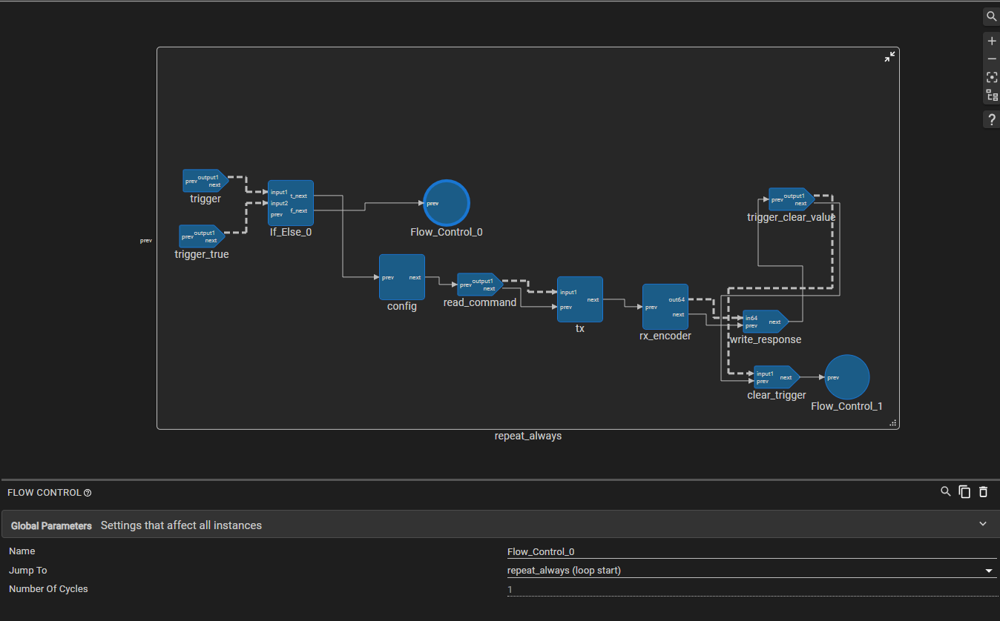
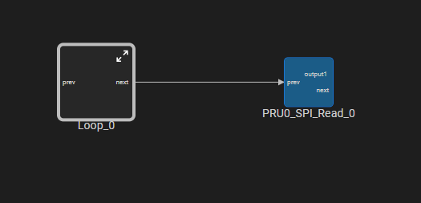
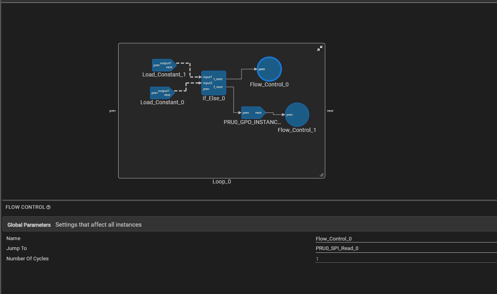

---

## Loop Block (Repetition Control)

### Purpose

Repeats a sequence of blocks a fixed number of times or infinitely. This is a container block — blocks dragged inside it execute on every iteration of the loop.

### Features

- Fixed count (1–65,535 iterations) or infinite loop mode
- Uses the PRU hardware `LOOP` instruction for fixed loops (minimal overhead)
- Pre-Initialization Blocks — run selected blocks once before the loop starts
- Resizable container (default 500×250 px)
- Nested loops supported (place a Loop inside another Loop)
- Loop counter register auto-sized based on iteration count

### Configuration

| Parameter | Description | Range / Options |
|-----------|-------------|-----------------|
| Infinite Loop | Loop forever without exit | true, false (default: false) |
| Loop Count | Number of iterations | 1–65,535 (hidden when Infinite Loop = true) |
| Pre-Initialization Blocks | Blocks inside the loop whose code runs once before the loop starts | Multi-select from blocks inside the loop |

### How It Works

1. **Drag blocks** into the gray loop container — they become the loop body
2. **Set Loop Count** or enable Infinite Loop
3. **Optionally** mark blocks as Pre-Initialization to run them once before the loop
4. On each iteration, all non-pre-init blocks execute in connection order

### Continue and Break implementation using Flow Control Blocks

#### Continue 
We can use Flow control to select the start label of the loop block (e.g. `loop_0_start`). For a finite loop, this reloads the counter (restarts the loop with the original count), not a true continue. Only for an infinite loop does jumping back to `_start` behave like a clean continue, as shown below with the `tamagawa_single_channel` example.

<figure>

<figcaption>Implement continue in infinite loop</figcaption>
</figure>

#### Break
We can use Flow control to select the start label of the block connected outside the loop block and then jump to its start label using the flow control, check out the below image in which we implement break when a condition is satisfied 

<figure>

<figcaption>SPI block is connected next to loop block</figcaption>
</figure>

<figure>

<figcaption>In the true branch of if/else SPI read block's start label is selected to jump to using the flow control</figcaption>
</figure>


### Pre-Initialization Blocks

Pre-init blocks are physically inside the loop container but their generated code is placed **before** the loop instruction. This is useful for:

- **Accumulator initialization**: Set a running total to 0 once before accumulating across iterations
- **Counter setup**: Initialize a starting value once
- **One-time configuration**: Configure a peripheral before a repeated operation

**Example — transmitting incrementing values 1, 2, 3, ..., N over SPI:**

```
Inside loop container:
  Load_Constant_0 (value=0)  ← mark as Pre-Init
  Load_Constant_1 (value=1)
  Arithmetic_ADD (result = result + 1)
  SPI_Write (sends result)

Without pre-init: sends 1, 1, 1, 1 (accumulator resets each iteration)
With pre-init:    sends 1, 2, 3, 4 (accumulator initialized once)
```

### Generated Assembly

**Fixed count loop (no pre-init):**
```assembly
LDI     loop_counter, loop_count     ; Load iteration count (1-2 cycles)
LOOP    endloop_label, loop_counter  ; Hardware LOOP instruction
; ... loop body blocks ...
endloop_label:
```

**Fixed count loop (with pre-init):**
```assembly
; Pre-init blocks execute ONCE here
LDI     R0.b1, 0                     ; e.g., initialize accumulator

LDI     loop_counter, loop_count
LOOP    endloop_label, loop_counter
; ... remaining body blocks ...
endloop_label:
```

**Infinite loop:**
```assembly
; Pre-init blocks (if any) execute once here
startloop_label:
; ... loop body blocks ...
QBA     startloop_label              ; Unconditional jump back
```

### Performance

| Scenario | Overhead |
|----------|---------|
| Fixed loop setup (for finite loop) | 2 cycle (counter load + LOOP instruction) |
| Per iteration (infinite) | 1 cycle (unconditional jump) |

**Total cycles**
for finite loop : 2 + (loop_body)*iterations 
for infinite loop : (1 + loop_body) per iteration 

Example: 100 iterations, body = 11 cycles → 2 + (100 × 11) = 1102 cycles = 5.510 µs at 200 MHz

### Loop Counter Register Sizing

| Loop Count | Register Size |
|-----------|--------------|
| 1–255 | 1 byte |
| 256–65,535 | 2 bytes |

### Ports

| Port | Available When | Description |
|------|---------------|-------------|
| prev | Always | Connects from previous block |
| next | Infinite Loop = false only | Connects to block after loop completes |

### Important Notes

- Maximum loop count is **65,535** (16-bit PRU LOOP instruction limit)
- For higher iteration counts, use nested loops (e.g., 65,535 × 65,535 ≈ 4 billion)
- Infinite loops **never exit** — the `next` port is hidden and no code after the loop is reachable
- Loop counter occupies a register during loop execution
- Pre-init blocks are still visually inside the container but their instructions are hoisted out
- A **Flow Control** block elsewhere can jump to this loop's label (`startloop_label` for infinite). Note: for finite loops, jumping to `_start` re-arms `LOOP` (counter reloads), not a true continue; only infinite loops continue cleanly.

---
