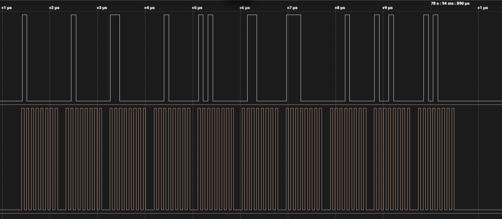

# Incremental SPI

## Introduction

This example demonstrates the use of pru-no-code-tool to send incremental data (1 to 10 (LSB first)) through SPI protocol using the pre-init feature of the loop block 
probe pin 19 (SDO) and pin 17 (SCLK) in case of am243x and pin 11 (SCLK) and pin 67 (SDO) in case of am261x and to observe the waveform which should be similar to the following snapshot taken from the logic analyzer 

<figure>

<figcaption>Incremental data (1-10) sent through SPI , in the figure, white signal represent the Data and the brown signal represent the Clock</figcaption>
</figure>

---

## No-Code Tool Block Design

This example's key feature is the Loop block's **Pre-Initialization** mechanism. Understanding why it matters here is the whole point of the example.

### The Pre-Init Problem and Solution

The loop body contains an ADD block that accumulates a counter: `result = result + 1`. For this to work across iterations, the register holding the initial value must be written **once** before the loop starts — not reset to 0 on every iteration.

Without pre-init, `Load_Constant_0` executes inside the loop body every iteration, resetting the accumulator register back to 0 each time. The ADD then always computes `0 + 1 = 1`, and SPI sends `1, 1, 1, 1...`

With `Load_Constant_0` marked as a **pre-init block**, the tool moves its `LDI` instruction to before the hardware `LOOP` instruction. The register is initialised to 0 once. Each iteration the ADD overwrites the same register with the incremented value, which persists into the next iteration. SPI sends `1, 2, 3, ... 10`.

### Block Flow

```
PRE-INIT (executes once before loop starts):
    [Load Constant: Load_Constant_0]   value = 0  →  initialises accumulator register

━━━━━━━━━━━━━━━━━━━━━━━━━━━━━━━━━━━━━━━━━━━━━━━━━━
[Loop: Loop_0]  10 iterations
┌──────────────────────────────────────────────────┐
│   [Load Constant: Load_Constant_1]   value = 1   │
│           │                                      │
│           │  (increment)                         │
│           ▼                                      │
│   [Arithmetic: Arithmetic_0]  ADD               │
│       input1 ← Load_Constant_0 register          │
│       input2 ← Load_Constant_1 (1)               │
│       output → overwrites accumulator register   │
│           │                                      │
│           ▼                                      │
│   [SPI Write: PRU0_SPI_Write_0]                  │
│       transmit accumulator value over SPI        │
└──────────────────────────────────────────────────┘
        │
        ▼
[Flow Control: Flow_Control_0]   HALT
```

**Result per iteration:** register = 0+1=1, 1+1=2, 2+1=3 ... 9+1=10 → SPI sends `1, 2, 3, 4, 5, 6, 7, 8, 9, 10`.

### Block Configuration Details

**Load Constant (`Load_Constant_0`)**
- Value: 0 (default) — accumulator seed
- Marked as **pre-init block** on `Loop_0`: its `LDI R, 0` is emitted once before the `LOOP` instruction, not inside the loop body

**Load Constant (`Load_Constant_1`)**
- Value: 1 — the fixed increment added each iteration
- Executes inside the loop body every iteration (not pre-init)

**Arithmetic (`Arithmetic_0`)**
- Operation: ADD (default)
- input1: `Load_Constant_0` output register (the accumulator — initialised to 0 pre-loop, then holds the running total)
- input2: `Load_Constant_1` output (constant 1)
- output: written back to the same register as input1, so the value carries forward to the next iteration

**Loop (`Loop_0`)**
- Loop count: 10
- Pre-init blocks: `Load_Constant_0` — ensures the accumulator register is zeroed exactly once
- Contains: `Load_Constant_0`, `Load_Constant_1`, `Arithmetic_0`, `PRU0_SPI_Write_0`

**SPI Write (`PRU0_SPI_Write_0`)**
- Packet size: 8 bits (default)
- SDO signal: GPO3, SCLK signal: GPO4, CS signal: GPO5
- Transmits the accumulator value after each ADD — one SPI frame per loop iteration

**Flow Control (`Flow_Control_0`)**
- Operation: HALT — stops PRU0 after all 10 frames are sent

### Generated Assembly Structure

```asm
; Pre-init: Load_Constant_0 emitted here (outside loop)
LDI    Rx.b0, 0                     ; initialise accumulator once

; Loop overhead
LDI    Ry.b0, 10                    ; loop counter
LOOP   Loop_0_end, Ry.b0

    ; Load_Constant_1 (inside loop body)
    LDI    Rz.b0, 1

    ; Arithmetic_0: ADD
    ADD    Rx.b0, Rx.b0, Rz.b0      ; Rx = Rx + 1  (1, 2, 3 ... 10)

    ; PRU0_SPI_Write_0: transmit Rx.b0 over SPI
    ; ... SPI bit-bang instructions ...

Loop_0_end:
HALT
```

---

# Supported Combinations

 Parameter      | Value
 ---------------|-----------
 ICSSG          | ICSSG0 - PRU0
 ICSSM          | ICSSM1 - PRU0 (am261x only)
 Toolchain      | pru-cgt
 Board          | am243x-lp, am261x-lp
 Example folder | examples/incremental_spi/

# Steps to Run the Example

> Prerequisite: [PRU-CGT-2-3](https://www.ti.com/tool/PRU-CGT) (ti-pru-cgt) should be installed at: `C:/ti/`

- **When using CCS projects to build**, import the CCS project from the above mentioned Example folder path for R5F and PRU, After this `main.asm`, `linker.cmd` files gets copied to ccs workspace of PRU project. The `main.asm` contains sample code to halt PRU program

     - Build the PRU project using the CCS project menu (see [for AM64x](https://software-dl.ti.com/mcu-plus-sdk/esd/AM64X/latest/exports/docs/api_guide_am64x/CCS_PROJECTS_PAGE.html), [for AM243x](https://software-dl.ti.com/mcu-plus-sdk/esd/AM243X/latest/exports/docs/api_guide_am243x/CCS_PROJECTS_PAGE.html), [for AM261x](https://software-dl.ti.com/mcu-plus-sdk/esd/AM261X/latest/exports/docs/api_guide_am261x/CCS_PROJECTS_PAGE.html)).
          - Build Flow: Once you click on build in PRU project, firmware header file which is generated in release or debug folder of ccs workspace, is moved to  `<pru-no-code-tool/examples/incremental_spi/firmware/device/>`

     - Build the R5F project using the CCS project menu (see [for AM64x](https://software-dl.ti.com/mcu-plus-sdk/esd/AM64X/latest/exports/docs/api_guide_am64x/CCS_PROJECTS_PAGE.html), [for AM243x](https://software-dl.ti.com/mcu-plus-sdk/esd/AM243X/latest/exports/docs/api_guide_am243x/CCS_PROJECTS_PAGE.html), [for AM261x](https://software-dl.ti.com/mcu-plus-sdk/esd/AM261X/latest/exports/docs/api_guide_am261x/CCS_PROJECTS_PAGE.html)).
          - Firmware header file path is included in R5F project include options by default, Instructions in Firmware header file can be written into PRU IRAM memory using PRUICSS_loadFirmware API (see [for AM64x](https://software-dl.ti.com/mcu-plus-sdk/esd/AM64X/latest/exports/docs/api_guide_am64x/group__DRV__PRUICSS__MODULE.html#ga3e7c763e5343fe98f7011f388a0b7ffe), [for AM243x](https://software-dl.ti.com/mcu-plus-sdk/esd/AM243X/latest/exports/docs/api_guide_am243x/group__DRV__PRUICSS__MODULE.html#ga3e7c763e5343fe98f7011f388a0b7ffe))
          - Build Flow: Once you click on build in R5F project, SysConfig files are generated, Finally the R5F project will be generated using both the generated SysConfig and PRU project binaries.

     - Launch a CCS debug session and run the executable, (see [for AM64x](https://software-dl.ti.com/mcu-plus-sdk/esd/AM64X/latest/exports/docs/api_guide_am64x/CCS_LAUNCH_PAGE.html), [for AM243x](https://software-dl.ti.com/mcu-plus-sdk/esd/AM243X/latest/exports/docs/api_guide_am243x/CCS_LAUNCH_PAGE.html), [for AM261x](https://software-dl.ti.com/mcu-plus-sdk/esd/AM261X/latest/exports/docs/api_guide_am261x/CCS_LAUNCH_PAGE.html))
     
