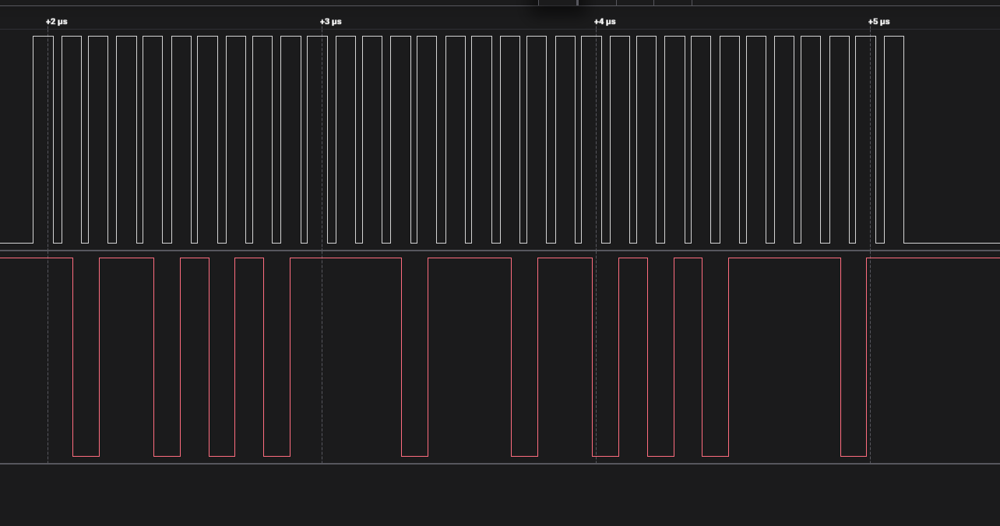

# SPI Transfer at 10MHz

## Introduction

This example demonstrates the use of the PRU No-Code Tool to achieve a 10MHz SPI clock on the AM261x platform using a PRU core clock of 200MHz. PRU0 acts as the SPI controller using the **SPI Transfer block** (full-duplex) and PRU1 acts as the SPI peripheral using the **SPI Write block**.

The purpose of this example is to validate both directions of the SPI Transfer block:
- **TX path (PRU0 → PRU1)**: PRU0 transmits 32-bit data over SDO. Verified using a Saleae logic analyzer.
- **RX path (PRU1 → PRU0)**: PRU1 emulates an encoder response by driving known data (0xDEADDEAD) back over its SDO using the SPI Write slave block, which PRU0 receives via its SDI pin. This allows the RX path of the SPI Transfer block to be validated without requiring actual encoder hardware.

After running the example the data recieved by the SPI transfer block is stored in register **R0 of PRU0**

SPI mode used: **MODE1** (CPOL=0, CPHA=1). All 4 modes are supported.

<figure>

<figcaption>In the figure, white signal represent the clock (70ns high and 30ns low) and the red signal represent the data (1 bit = 10ns)</figcaption>
</figure>

---

## Timing Configuration

| Parameter | Value |
|-----------|-------|
| PRU clock | 200 MHz (AM261x ZFG 400MHz variant) |
| SCLK high width | 14 PRU cycles |
| SCLK low width | 6 PRU cycles |
| SPI clock frequency | 200MHz / (14+6) = **10 MHz** |
| Data setup time | 50 ns (10 PRU cycles) |
| CS setup time | 500 ns |
| CS hold time | 500 ns |

> **Note:** The SCLK high width of 14 cycles is the minimum achievable with a 50ns data setup time requirement.
> At 200MHz PRU clock: `ceil(50ns × 200/1000) = 10 cycles` data setup overhead, giving `high_min = 4 + 10 = 14 cycles`.

---

## No-Code Tool Block Design

### PRU0 — SPI Controller (Transfer block)

```
[Load Constant: Load_Constant_0]     value = 0xABCDEFAB (32-bit data to transmit)
        │
        ▼
[SPI Transfer: PRU0_SPI_Transfer_0]  full-duplex, controller mode, MODE1, 32-bit MSB first
        │                            SCLK high = 14 cycles, low = 6 cycles → 10MHz
        │                            Data setup = 50ns, CS setup = 500ns, CS hold = 500ns
        │                            SCLK → GPO0, SDO → GPO1, SDI ← GPI6, CS → GPO2
        ▼
[Flow Control: Flow_Control_0]       HALT
```

### PRU1 — SPI Peripheral (Write block)

```
[Load Constant: Load_Constant_0]     value = 0xDEADDEAD (32-bit data to send back to controller)
        │
        ▼
[SPI Write: PRU1_SPI_Write_0]        peripheral mode, MODE1, 32-bit MSB first
        │                            waits for CS assert from PRU0, then sends data on SDO
        │                            SCLK ← GPI4, SDI ← GPI5, SDO → GPO1, CS ← GPI6
        ▼
[Flow Control: Flow_Control_0]       HALT
```

---

## Block Configuration Details

### PRU0 Blocks

**Load Constant (`Load_Constant_0`)**
- Value: 2882400171 (0xABCDEFAB) — 32-bit test pattern to transmit

**SPI Transfer (`PRU0_SPI_Transfer_0`)**
- Packet size: 32 bits
- Device mode: Controller
- SPI mode: MODE1 (CPOL=0, CPHA=1)
- Endianness: MSB first
- SCLK high pulse width: 14 PRU cycles
- SCLK low pulse width: 6 PRU cycles
- Data setup time: 50ns
- CS setup time: 500ns
- CS hold time: 500ns
- SCLK signal: GPO0
- SDO signal: GPO1
- SDI signal: GPI6
- CS signal: GPO2

**Flow Control (`Flow_Control_0`)**
- Operation: HALT

---

### PRU1 Blocks

**Load Constant (`Load_Constant_0`)**
- Value: 3735936685 (0xDEADDEAD) — 32-bit test pattern PRU1 sends back to PRU0 to emulate the encoder response 

**SPI Write (`PRU1_SPI_Write_0`)**
- Packet size: 32 bits
- Device mode: Peripheral
- SPI mode: MODE1 (CPOL=0, CPHA=1)
- Endianness: MSB first
- SCLK signal: GPI4
- SDI signal: GPI5
- SDO signal: GPO1
- CS signal: GPI6
- CS filter cycles: 2

**Flow Control (`Flow_Control_0`)**
- Operation: HALT

---

## Pin Connections

PRU0 drives SCLK and CS; both PRUs drive their respective SDO lines.

| Signal | PRU0 pin (controller) | PRU1 pin (peripheral) |
|--------|-----------------------|-----------------------|
| SCLK | GPO0 | GPI4 |
| SDO  | GPO1 | GPO5 |
| SDI  | GPI6 | ---- |
| CS | GPO2 | GPI6 |

---

## Why SPI Write slave instead of SPI Transfer slave?

The SPI Transfer slave (full-duplex peripheral) has a practical maximum frequency of **7.69MHz at 200MHz PRU clock** due to the polling overhead of the software-based slave. The slave needs ~13 cycles minimum in both high and low phases to detect edges reliably.

The SPI Write slave (TX only peripheral) relaxes the low phase constraint since it does not need to sample SDI, allowing the controller's low width to go down to 6 cycles. This enables the 10MHz clock while still validating the RX path of the controller's Transfer block.

In this example the SPI Write slave on PRU1 serves as an **encoder emulator** — it sends back a fixed known pattern (0xDEADDEAD) to simulate the response a real encoder would send over SPI. This lets the RX path of the Transfer block be fully tested at 10MHz without needing actual encoder hardware connected.

For a full bidirectional loopback at 200MHz PRU clock, use `high=13, low=13` giving **7.69MHz**. For 333MHz PRU clock (AM243x), the practical max is **12.8MHz** with `high=13, low=13`.

---

# Supported Combinations

 Parameter      | Value
 ---------------|-----------
 ICSSM          | ICSSM1 - PRU0, PRU1 (am261x only)
 Toolchain      | pru-cgt
 Board          | am261x-lp
 Example folder | examples/spi_10mhz/

# Steps to Run the Example

> Prerequisite: [PRU-CGT-2-3](https://www.ti.com/tool/PRU-CGT) (ti-pru-cgt) should be installed at: `C:/ti/`

- **When using CCS projects to build**, import the CCS project from the above mentioned Example folder path for R5F and PRU. After this `main.asm`, `linker.cmd` files get copied to the CCS workspace of the PRU project. The `main.asm` contains sample code to halt the PRU program.

     - Build the PRU project using the CCS project menu (see [for AM261x](https://software-dl.ti.com/mcu-plus-sdk/esd/AM261X/latest/exports/docs/api_guide_am261x/CCS_PROJECTS_PAGE.html)).
          - Build Flow: Once you click on build in PRU project, the firmware header file generated in the release or debug folder of the CCS workspace is moved to `<pru-no-code-tool/examples/spi_10mhz/firmware/device/>`

     - Build the R5F project using the CCS project menu (see [for AM261x](https://software-dl.ti.com/mcu-plus-sdk/esd/AM261X/latest/exports/docs/api_guide_am261x/CCS_PROJECTS_PAGE.html)).
          - The firmware header file path is included in R5F project include options by default. Instructions in the firmware header file can be written into PRU IRAM memory using the PRUICSS_loadFirmware API.

     - Launch a CCS debug session and run the executable (see [for AM261x](https://software-dl.ti.com/mcu-plus-sdk/esd/AM261X/latest/exports/docs/api_guide_am261x/CCS_LAUNCH_PAGE.html)).

     - Connect the SPI controller and peripheral pins as per the pin connections table above.

- **When using makefiles to build**:
     - For steps on how to use makefiles, run `make help` from the root folder of the pru-no-code-tool repository.
