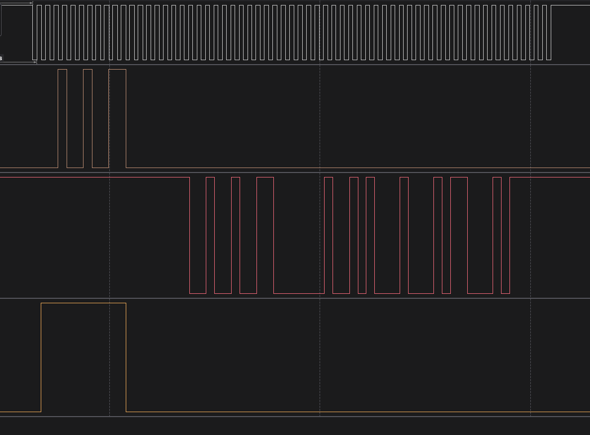

# Tamagawa Single Channel

## Introduction

This example demonstrates how to use the PRU No-Code Tool to communicate with a Tamagawa encoder over the ICSSG 3-Channel Peripheral Interface. The R5F writes a command byte and a trigger to shared memory. The PRU reads the command byte, transmits it to the encoder, receives the response, stores the raw RX bitstream in shared memory, and clears the trigger. The R5F then decodes the response based on which command was sent.

Three commands are supported:

| User Input | DATA_ID | Command byte (CF) | Description | RX frames |
|------------|---------|-------------------|-------------|-----------|
| `0` | DATA_ID_0 | `0x02` | Absolute position (ABS) | 6 |
| `1` | DATA_ID_1 | `0x8A` | Multi-turn data (ABM) | 6 |
| `2` | DATA_ID_2 | `0x92` | Encoder ID (ENID) | 4 |

The logic analyzer snapshot below shows the encoder command and response:

<figure>

<figcaption>Tamagawa DATA_ID_2 transaction — white : PERIF0_CLK, brown : Tx data (0x92), red : Encoder Response, yellow : PERIF0_OUT_EN</figcaption>
</figure>

---

## Hardware Setup

The Tamagawa booster pack is connected to the AM243x-LP. The encoder power enable pin (GPIO1_78, MMC1_SDWP, J5.C16) must be driven HIGH by the R5F before loading PRU firmware. The encoder RX line is routed to PRU1 channel 0 via the SA_MUX (GPI13 → PERIF0_IN).

| Signal         | AM243x-LP Pin | Notes                          |
|----------------|---------------|--------------------------------|
| PERIF0_CLK     | PRG0_PRU1_GPO0 (L5) | Encoder clock output      |
| PERIF0_OUT     | PRG0_PRU1_GPO1 (J2) | TX to encoder              |
| PERIF0_OUT_EN  | PRG0_PRU1_GPO2 (M2) | TX enable                  |
| PERIF0_IN      | PRG0_PRU1_GPI13 (T4)| RX from encoder (via SA_MUX)|
| Encoder Power  | MMC1_SDWP (C16)     | GPIO1_78, drive HIGH       |

---

## Tamagawa Protocol Background

Tamagawa is a synchronous serial encoder protocol using a 3-wire interface (CLK, TX, RX). The ICSSG 3-Channel Peripheral Interface handles the clocking and framing autonomously once configured.

Each wire frame is **10 bits**: `start(0) + data[b0..b7] + stop(1)`, transmitted LSB first.

**Supported commands:**

| DATA_ID | CF byte | TX frames | RX frames | RX fields |
|---------|---------|-----------|-----------|-----------|
| DATA_ID_0 | `0x02` | 1 | 6 | CF, SF, ABS[23:0], CRC |
| DATA_ID_1 | `0x8A` | 1 | 6 | CF, SF, ABM[23:0], CRC |
| DATA_ID_2 | `0x92` | 1 | 4 | CF, SF, ENID, CRC |

---

## No-Code Tool Block Design

The entire IPC loop — trigger polling, command read, UART config, TX, RX, result storage, and trigger clear — is implemented using no-code blocks. No hand-written assembly is needed.

The command byte is not hardcoded in the PRU. The R5F writes the desired CF byte into shared memory at offset `0x01` before setting the trigger. The PRU reads it with a `Memory Read` block and passes it directly to the `UART TX Op`.

### Block Flow

```
[Loop: repeat_always]
    │
    ├─► [Memory Read: trigger]        read trigger byte from shared memory offset 0x00
    │       │
    │   [Load Constant: trigger_true] load value 1
    │       │
    ├─► [If/Else: trigger == 1?]
    │       │
    │    TRUE branch:
    │       ├─► [UART Config: config]         configure peripheral (baud, frame size, clk mode)
    │       ├─► [Memory Read: read_command]   read command byte from shared memory offset 0x01
    │       ├─► [UART TX Op: tx]              transmit command byte to encoder (1 frame)
    │       ├─► [UART RX Op: rx_encoder]      receive encoder response (up to 62 wire bits)
    │       ├─► [Memory Write: write_response] store R1:R2 (64 bits) at shared memory offset 0x04
    │       ├─► [Load Constant: trigger_clear_value] load 0
    │       └─► [Memory Write: clear_trigger]  clear trigger byte at offset 0x00
    │
    └─► [Delay: nop]  (FALSE branch — yield one cycle before polling again)
```

### Block Configuration Details

**Memory Variable (`Memory_Variable_0`)**
- Size: 16 bytes
- Location: `smem` (PRU1 DRAM, physical base `0x30010000`)
- Layout:
  ```
  offset 0x00 : uint8_t  trigger        (R5F writes 1; PRU clears to 0 when done)
  offset 0x01 : uint8_t  command        (R5F writes CF byte before trigger)
  offset 0x02 : uint8_t  reserved[2]
  offset 0x04 : uint32_t result_lo      (R1 — raw RX bits [31:0])
  offset 0x08 : uint32_t result_hi      (R2 — raw RX bits [39:32])
  ```

**Memory Read (`trigger`)**
- Operation: read
- Offset: 0x00, size: 1 byte
- Reads the trigger byte set by R5F into `R0.b0`

**Load Constant (`trigger_true`)**
- Value: 1
- Used as the comparator input to the If/Else block

**If/Else (`If_Else_0`)**
- Condition: `input1 == input2` (trigger value == 1)
- TRUE → runs config + command read + TX + RX + store + clear
- FALSE → falls through to Delay (nop), then loops

**UART Config (`config`)**
- TX channel: 0, baud rate: 2.5 Mbps, clock source: 200 MHz
- TX frame: 8 data bits, start bit = 0 (low), stop bit = 1 (high), LSB first
- RX channel: 0, baud rate: 2.5 Mbps, 8x oversample
- RX frame size: 62 bits (covers up to 6 Tamagawa wire frames + margin)
- Clock mode: 1 (free-running, stops high after last RX frame — keeps clock running through encoder response)
- Configures GPCFG1 for peripheral mux mode on PRU1, sets TXCFG, RXCFG, CH0_CFG0

**Memory Read (`read_command`)**
- Operation: read
- Offset: 0x01, size: 1 byte
- Reads the CF byte written by the R5F into `R0.b0`, which is then fed directly into the UART TX Op

**UART TX Op (`tx`)**
- Input: `read_command` output (CF byte in R0.b0)
- Channel: 0, data bits: 8
- Performs per-command reinit (clears FIFO and state machines), loads 2 bytes to FIFO, triggers TX, waits for TX complete

**UART RX Op (`rx_encoder`)**
- Output registers: R1 (bits [31:0]), R2 (bits [39:32])
- Channel: 0, frame size: 62 bits
- Enables rx_en, polls valid flag per bit (8x oversampled), accumulates all bits LSB-first into R1:R2 as a raw bitstream, then right-shifts to align and strips the first start bit

**Memory Write (`write_response`)**
- Operation: write
- Offset: 0x04, size: 8 bytes
- Stores R1:R2 (64-bit result) to shared memory

**Load Constant (`trigger_clear_value`)**
- Value: 0

**Memory Write (`clear_trigger`)**
- Operation: write
- Offset: 0x00, size: 1 byte
- Writes 0 to trigger byte — signals R5F that transaction is complete

---

## Generated Assembly

The no-code blocks generate the following PRU assembly (`pru_syscfg.asm`):

```asm
sysconfig_generated_start:
startloop_0:
    m_memory_load R0.b0, buffer, 0, 1          ; read trigger byte
    LDI R0.b1, 1                                ; load trigger_true = 1
    QBNE If_Else_0_FALSE, R0.b1, R0.b0         ; if trigger != 1, skip
    m_uart_config_pru1_tx_ch0_lsb_start0_ss_rx_ch0_lsb_8x 0, 79, 1, 8, 0, 9, 1, 7, 0, 62
    m_memory_load R0.b0, buffer, 1, 1          ; read command byte from smem offset 0x01
    m_uart_tx_op_2byte_pru1_lsb_start0 R0.b0, 0, 8
    m_uart_rx_op_pru1_lsb_8x_ext R1, R2, 0, 9, 1, 7, 0, 62, 1
    m_memory_store_64 R1, R2, buffer, 4, 8      ; store result at offset 0x04
    LDI R0.b1, 0
    m_memory_store R0.b1, buffer, 0, 1          ; clear trigger
If_Else_0_FALSE:
    nop
    QBA startloop_0
```

---

## Decoding the RX Result on R5F

The RX macro collects all 62 wire bits as a raw bitstream (LSB first), strips the first start bit, and stores the result in R1:R2. Each Tamagawa frame occupies 10 bits in the stream (8 data bits + stop + start of next frame):

```
Raw bitstream layout (bit 0 = first data bit received):

bits [7:0]   = CF    (command field echo)
bit  [8]     = stop bit
bit  [9]     = start bit of next frame
bits [17:10] = SF    (status frame)
bits [27:20] = frame 2 data byte
bits [37:30] = frame 3 data byte
bits [47:40] = frame 4 data byte  (6-frame commands only)
bits [57:50] = frame 5 data byte  (6-frame commands only)
```

The general rule for any Tamagawa frame N (0-indexed):
```c
uint8_t frame_N_data = (raw >> (N * 10)) & 0xFF;
```

**DATA_ID_0 (6 frames) — Absolute position:**
```
bits [7:0]   = CF
bits [17:10] = SF
bits [27:20] = ABS[7:0]   (low byte)
bits [37:30] = ABS[15:8]  (mid byte)
bits [47:40] = ABS[23:16] (high byte)
bits [57:50] = CRC
```

**DATA_ID_1 (6 frames) — Multi-turn data:**
```
bits [7:0]   = CF
bits [17:10] = SF
bits [27:20] = ABM[7:0]   (low byte)
bits [37:30] = ABM[15:8]  (mid byte)
bits [47:40] = ABM[23:16] (high byte)
bits [57:50] = CRC
```

**DATA_ID_2 (4 frames) — Encoder ID:**
```
bits [7:0]   = CF
bits [17:10] = SF
bits [27:20] = ENID
bits [37:30] = CRC
```

R5F decoding (from `empty_example.c`):

```c
uint64_t raw = ((uint64_t)pResult[1] << 32) | pResult[0];

uint8_t cf = raw        & 0xFF;   // bits [7:0]
uint8_t sf = (raw >> 10) & 0xFF;  // bits [17:10]

// DATA_ID_0: Absolute position
uint32_t abs_pos = ((uint32_t)((raw >> 40) & 0xFF) << 16) |
                   ((uint32_t)((raw >> 30) & 0xFF) <<  8) |
                              ((raw >> 20) & 0xFF);
uint8_t crc = (raw >> 50) & 0xFF;

// DATA_ID_1: Multi-turn data
uint32_t abm     = ((uint32_t)((raw >> 40) & 0xFF) << 16) |
                   ((uint32_t)((raw >> 30) & 0xFF) <<  8) |
                              ((raw >> 20) & 0xFF);
uint8_t crc = (raw >> 50) & 0xFF;

// DATA_ID_2: Encoder ID
uint8_t enid = (raw >> 20) & 0xFF;
uint8_t crc  = (raw >> 30) & 0xFF;
```

---

# Supported Combinations

 Parameter      | Value
 ---------------|-----------
 ICSSG          | ICSSG0 - PRU1
 Toolchain      | pru-cgt
 Board          | am243x-lp
 Example folder | examples/tamagawa_single_channel/

# Steps to Run the Example

> Prerequisite: [PRU-CGT-2-3](https://www.ti.com/tool/PRU-CGT) (ti-pru-cgt) should be installed at: `C:/ti/`

- **When using CCS projects to build**, import the CCS project from the above mentioned Example folder path for R5F and PRU. After this `main.asm`, `linker.cmd` files get copied to the CCS workspace of the PRU project.
     - For hardware setup with the am243x-lp and the Tamagawa encoder, refer [this page](https://software-dl.ti.com/processor-industrial-sw/esd/motor_control_sdk/am243x/latest/docs/api_guide_am243x/EXAMPLE_MOTORCONTROL_TAMAGAWA.html)

     - Build the PRU project using the CCS project menu (see [for AM243x](https://software-dl.ti.com/mcu-plus-sdk/esd/AM243X/latest/exports/docs/api_guide_am243x/CCS_PROJECTS_PAGE.html)).
          - Build Flow: Once you click on build in the PRU project, the firmware header file generated in the release or debug folder of the CCS workspace is moved to `<pru-no-code-tool/examples/tamagawa_single_channel/firmware/am243x-lp/>`

     - Build the R5F project using the CCS project menu (see [for AM243x](https://software-dl.ti.com/mcu-plus-sdk/esd/AM243X/latest/exports/docs/api_guide_am243x/CCS_PROJECTS_PAGE.html)).
          - The firmware header file path is included in the R5F project include options by default. Instructions in the firmware header file can be written into PRU IRAM memory using the `PRUICSS_loadFirmware` API (see [for AM243x](https://software-dl.ti.com/mcu-plus-sdk/esd/AM243X/latest/exports/docs/api_guide_am243x/group__DRV__PRUICSS__MODULE.html#ga3e7c763e5343fe98f7011f388a0b7ffe)).

     - Launch a CCS debug session and run the executable (see [for AM243x](https://software-dl.ti.com/mcu-plus-sdk/esd/AM243X/latest/exports/docs/api_guide_am243x/CCS_LAUNCH_PAGE.html)).

     - Open a serial terminal (115200 8N1) on the UART backchannel port. Enter `0`, `1`, or `2` to select the command. The terminal will print the decoded fields for the selected DATA_ID.
